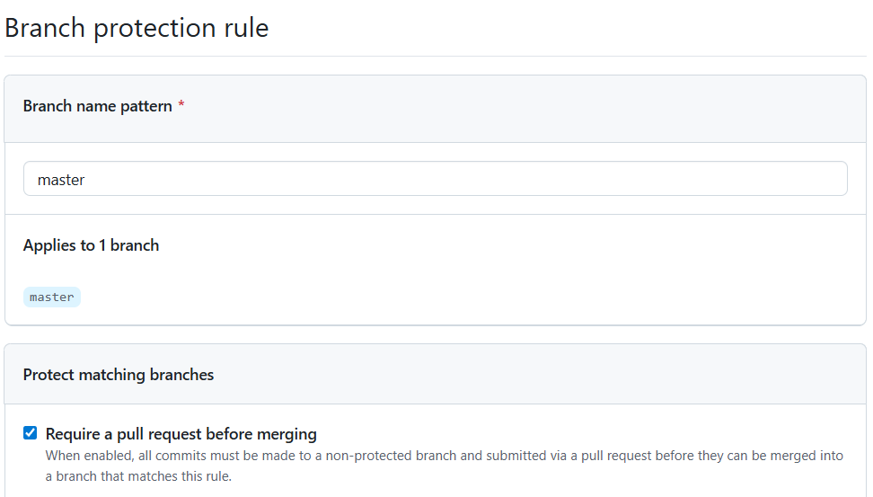
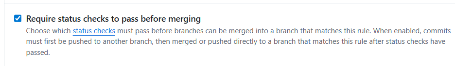
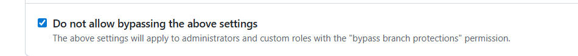

# X00197631_CA2 - GAA match event tracker
## Overview
This project aimed to create a tool to enable the recording and tracking of events in a Gaelic Football match. I created the tool in Python and Azure DevOps to deploy it.

## Technologies Used
Python\
Azure DevOps\
git\
GitHub\
VSCode (interpreter)\
*Dependencies*: Pylint, pytest, behave

## Local Development Setup
**Prerequisites:**\
Python\
pip\

**Cloning repo**
```
git clone https://github.com/JakeMurrayMcGuirk/X00197631_CA2.git
cd X00197631_CA2
```

**Setting up venv**
```
python -m venv env
env/scripts/Activate
```

**Running application**
```
python -m app
```

**Navigating the application**
The *help* command will show commands and what format to enter commands in to work the application.


## Application features
Users can start, pause and end games via commands. Events can be added to a list, and once the user ends the game (command: "eg"), a CSV file of the match events is output. Events can also be deleted via the delete command.

## CI Foundations
Using the lab material I integrated pylint and unit testing into my Azure DevOps pipeline. I used a mixture of StackOverflow, ChatGPT and Reddit to assist me in setting up the pipeline, especially with the configuration of the YAML and .yml file for Python.

## Testing Strategy
### Unit Tests
I used pytest to create the unit tests for this program. I was unsure of the use of Generative AI allowed at the time of making CA2, so I decided to write all unit tests by hand. I used ChatGPT to assist in giving me ideas of what unit tests could increase coverage but I wrote all of the unit tests myself, only using ChatGPT or Gemini to aid with detecting minor errors and bugs in my code (such as accidentally asserting different dtypes).

### Pylint
As per the spec's suggestion I used Pylint to generate static code coverage statistics on my work. Since I wrote all of the unit tests by hand in CA2 and my lack of unit tests written, I fell short of the 80% enforced code coverage.


## Troubleshooting Guide
If an issue arises when logging events, double check format is correct via *help* command (rule of thumb is event, outcome, player number). Feel free to log a ticket in the repo's "issue" section.

## UAT Testing with behave
### UAT writing
I used ChatGPT to aid in writing User Acceptance tests. I then corrected the errors from ChatGPT's generated code, as it got the order and format of outputs wrong. Initially it assumed player numbers were output as integers, that the events were output as dictionaries and that the events were only recorded in terms of outcomes (point, goal, wide) rather than including "shot" as the event, for example. I corrected all of these UATs to assert events correctly so that "shot" was asserted as it should be and added assertion for the outcome too to double-check it. I then wrapped the assertion for integers as a string so that it asserted player numbers correctly.

### Integration with YAML
Had to re-configure the pipelines for the new repository name, as prior to submitting CA2 my repo was named "match-event-tracker". Created new pipeline due to the issues created from this name mismatch. DevOps threw error about repo being "permanently moved" and couldn't find a way to point it to new repo name. I had to approve use of the "test" environment to run the "Deploy to test" stage of my pipeline.

## Security and Performance Testing
### Dependency security testing
Based my dependency security testing off of the lab material. Stored the NVD API Key as a variable in my environment to avoid leaking the API Key via my yml file accidentally.
### Performance Testing
I used pytest-benchmark to write performance tests for the application. I used the pytest-benchmark documentation (https://pytest-benchmark.readthedocs.io/en/latest/), and a browserstack tutorial (https://www.browserstack.com/guide/python-performance-testing) as well as assistance from ChatGPT to write my performance tests and integrate them with my Azure DevOps pipeline and yml file.

## CI Pipeline Implementation
I consulted Microsoft documentation and the lab material quite a bit while working on the CI Pipeline integration for this project, especially while working with the yml file due to my lack of experience with YAML and software dev pipelines in general. Generative AI was also used to double-check my work on YAML files and to assist in certain issues I faced when configuring the yml file. One such example is when I wanted to go from a single-stage to multi-stage pipeline, and I didn't add "dependsOn" to each stage, with each stage running in parallel instead of depending on the previous stage.
### Multi-stage YAML configuration
I used the Lab material and Microsoft's tutorial on creating multi-stage pipelines (https://learn.microsoft.com/en-us/azure/devops/pipelines/process/create-multistage-pipeline?view=azure-devops) to tweak my yml file to split my pipeline into stages.

## Branch policies and protection
I removed the ability to force pushes to main and the ability to merge with main without a pull request or approval (self-approved via pull requests for this assignment).\
Pull requests are required before merging into main.\

Status checks are also required to pass before merging\


Bypassing of these settings is not allowed by admins.


## Pipeline Approval Gates
After adding UAT's, I moved on to adding approval gates before I could deploy to a production environment. I used the lecture material along with Microsoft's documentation on creating approval gates (https://learn.microsoft.com/en-us/azure/devops/pipelines/release/approvals/gates?view=azure-devops).\
I created a production environment on the Azure DevOps portal to avoid deploying the application to production without adding any approval checks, like with the deployment to test environment earlier.\
After creating the production environment, I updated the .yml file with the necessary code to enable deployment to production environment once the UAT stage has been passed, pending approval by an approver (which is just me in this case).
